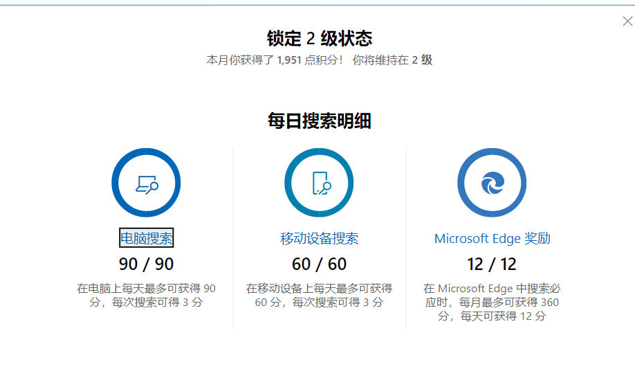
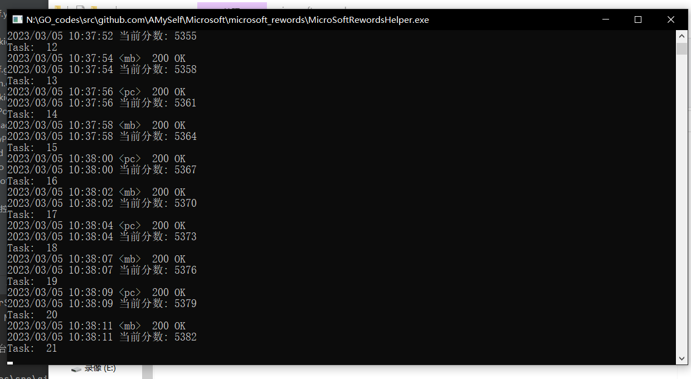
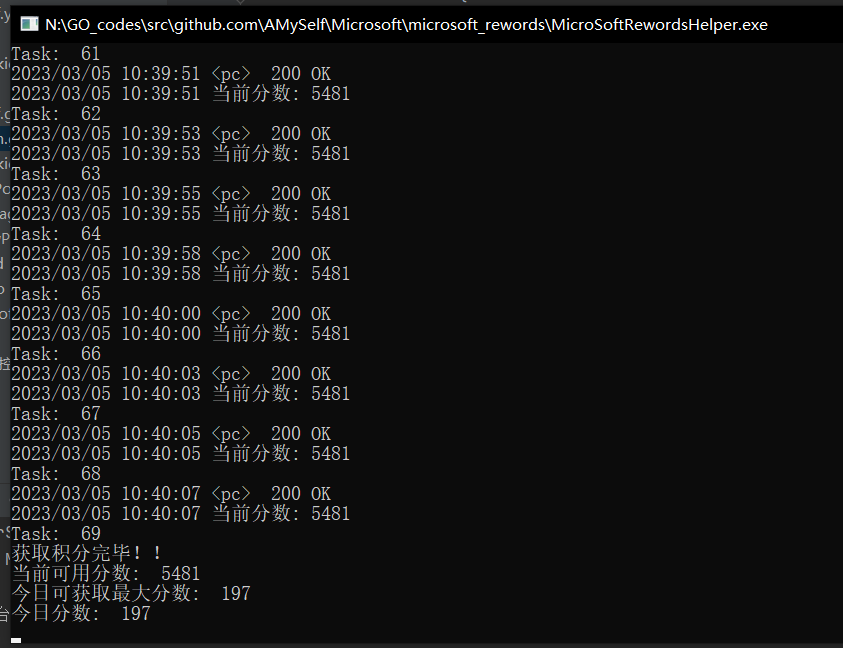
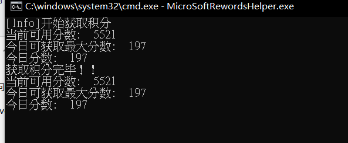
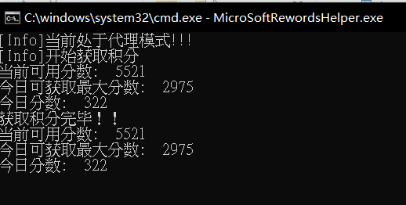
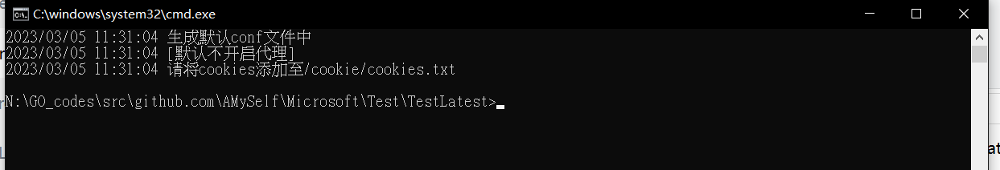

# 微软积分助手

[](https://github.com/Clov614/rewards-helper/actions/workflows/release.yml)

自动化获取微软积分

## ~~Action版(outdated)： [microsoft-rewards-helper-action](https://github.com/Clov614/microsoft-rewards-helper-action)~~

~~借助工作流的定时任务，实现每日自动刷取积分~~

## 功能概述

<details>
<summary>自动化获取积分</summary>
    
    
    
    
</details>

<details>
<summary>通过配置代理转发获取外区积分</summary>
    
    
</details>

## 开始使用
> windows平台 建议使用run.bat启动

> 第一次执行双击文件运行自动生成run.bat **(需要将其重命名为`rewards-helper`)**

~~#### `start cmd /K rewards-helper.exe` **(rewards-helper.exe为可执行文件的名称具体文件名根据实际有所出入)**~~

~~文本文件写入 `start cmd /K rewards-helper.exe` 后，改后缀.txt为.bat~~

### 1. [下载对应平台的可执行文件](https://github.com/Clov614/rewards-helper/releases/)

> win10/11平台下载**rewards-helper_windows_amd64**

### 2. 第一次运行会进行初始化生成配置文件

<details>
<summary>双击run.bat运行程序后</summary>
    
</details>

```
/conf/conf.yaml       // 设置文件
/cookie/cookies.txt   // cookies
```

### 3. 将cookie添加至 cookies.txt

> step1: 访问 [https://rewards.bing.com/]() 打开开发者控制台(刷新页面获取最新请求包)
> 
> step2: 复制header(请求头) 中的cookie值，粘贴至 **/cookie/cookies.txt** (ctal + s 保存)
>

<details>
<summary>图片步骤</summary>
    
    
    
</details>

配置cookie失败请参考: [InvalidCookie.md](source/doc/InvalidCookie.md)

### 4. 重新运行程序

### 其他启动方式

#### webui启动: 双击run-web.bat

webui暂时不完整，闲暇时间持续迭代中

## 配置相关

#### 配置文件示例

> /conf/conf.yaml

```yaml
# 配置文件
# proxy_on 是否开启代理模式 （true or false)
# proxy 代理地址 
# key_words 发起请求的关键词
proxy_on: flase
proxy: http://127.0.0.1:7890
key_words:
    - 关键字1
    - 关键字2
    - 关键字3
```

### TODO

- [x] 一个简易的webui
- [ ] 半自动更新cookie
  - 打算采用selenium方式？