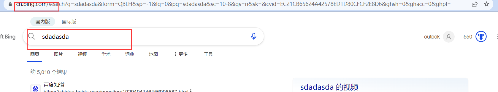

# 配置后的cookie无效

## 前置条件：

> 首次登陆谷歌账号，配置后的cookie无效

### 步骤一：点击积分明细

### 步骤二：点击电脑搜索，进行内容的搜索（只要搜索一个在重新配置）

### 步骤三：在进行内容搜索的同时，观察web页面右侧蓝色奖杯的积分数是否发生变化，变化则有效，可以去reward.bing.com下重新配置cookie

### 步骤四：按照下图步骤F12检查（开发者模式），复制超长cookies，然后到我们的配置文件cookie.txt进行粘贴

### 步骤五：运行bat启动文件

### 步骤六：如下图所示，发生积分自动增长

